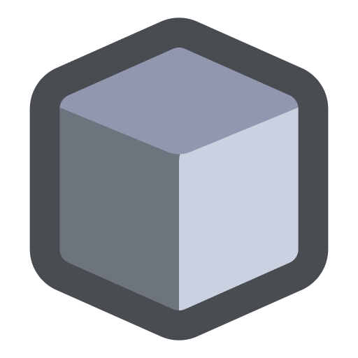

<h1 align="center">Tungsten is moving to a new repository in favor to a more Roblox focused environment, you can find it <a href="https://github.com/pwnwrkz/tungsten">here</a>.</h1>

<h1 align="center">Tungsten</h1>
 

<b>Another command line tool to handle Roblox assets similar to Tarmac and Asphalt.</b>

Designed mainly for images, Tungsten mimics Asphalt and Tarmac closely, with spritesheet packing that Asphalt lacks.

Originally built for <a href="https://github.com/notmagniill/LucideRoblox">LucideRoblox</a>.

<h2>To get started or gather more info about Tungsten, visit the <a href="https://github.com/notmagniill/tungsten/wiki">wiki</a>.</h2>
